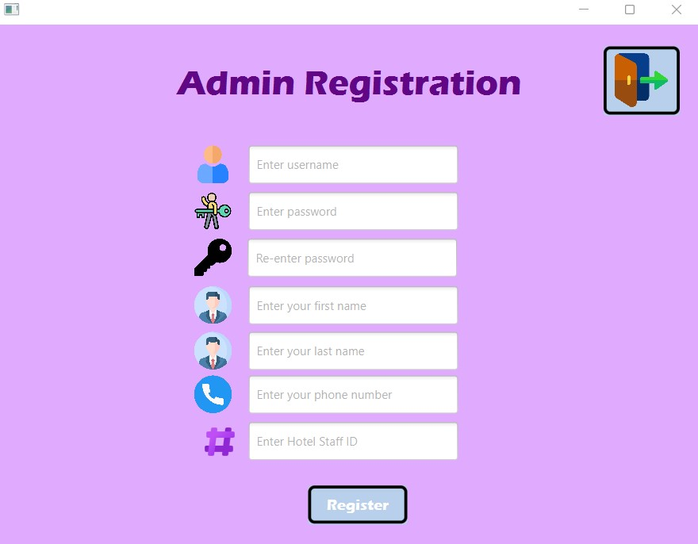
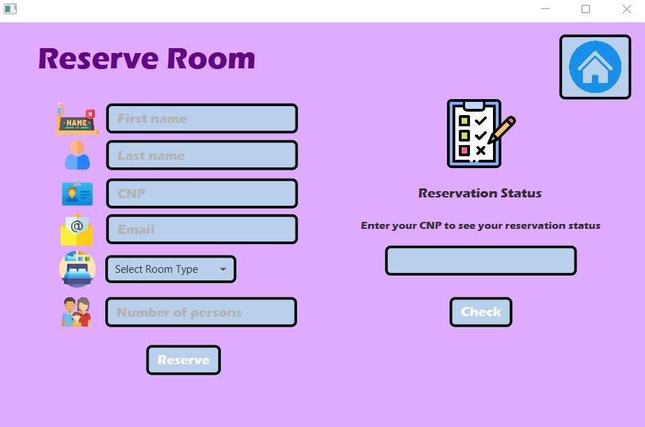
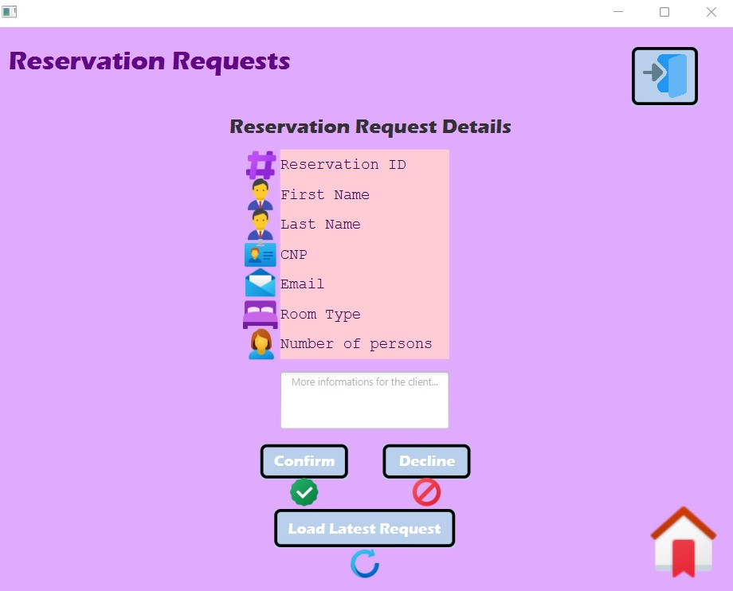

# Hotel Management Application 
### FIS Project 2022
# Team Members:
## Berejnec Adrian-Daniel
## Belcea Vlad

### How to run our application:
## -you can run mvn javafx:run in our main folder
## -switch to /target folder and run the following command:
### java -jar --module-path "C:\Program Files\Java\javafx-sdk-18.0.1\lib" --add-modules javafx.controls,javafx.fxml Hotel-Management-App-1.0-SNAPSHOT.jar
### This command will execute our jar file
## A few images of our app

